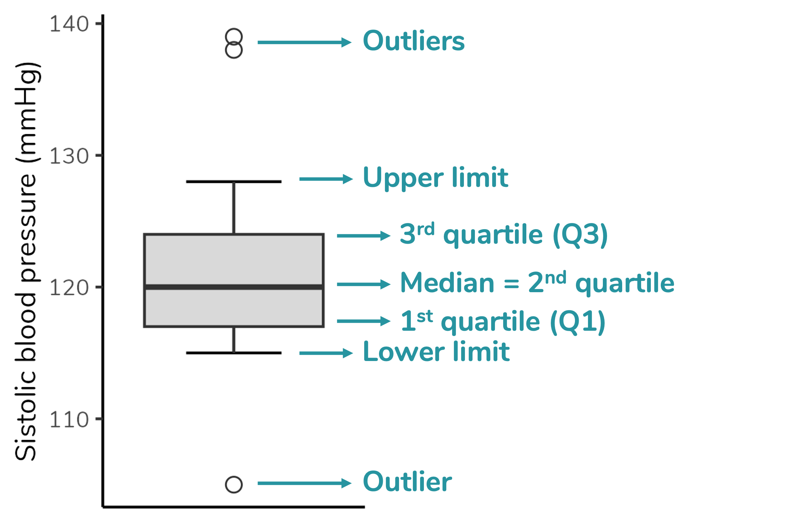
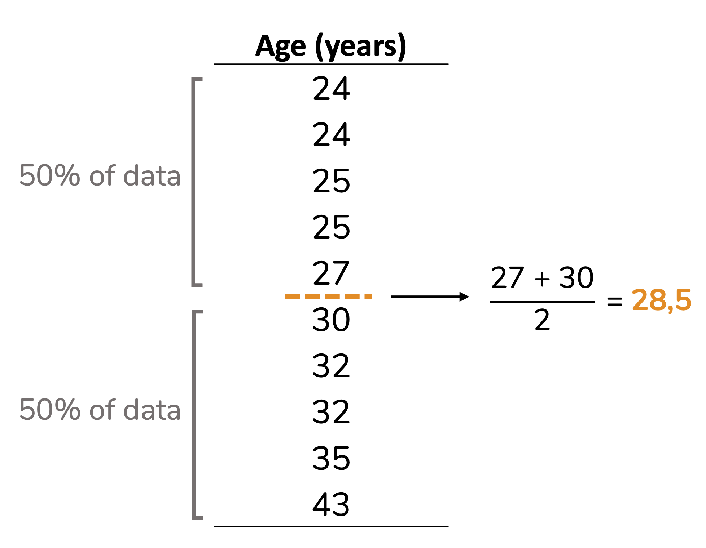
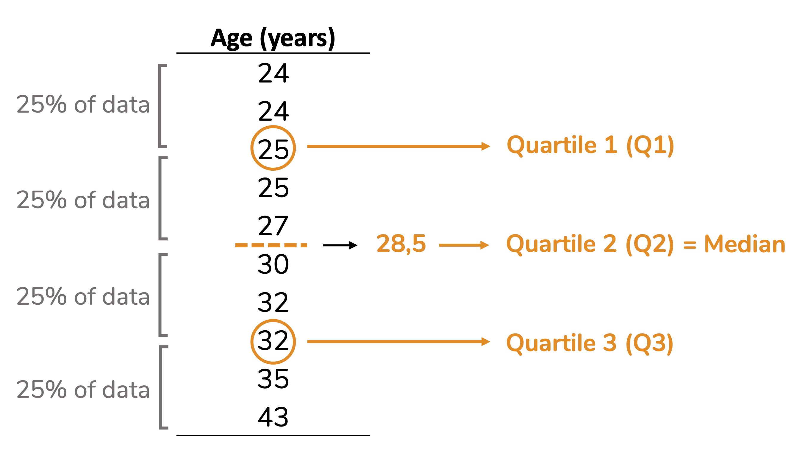
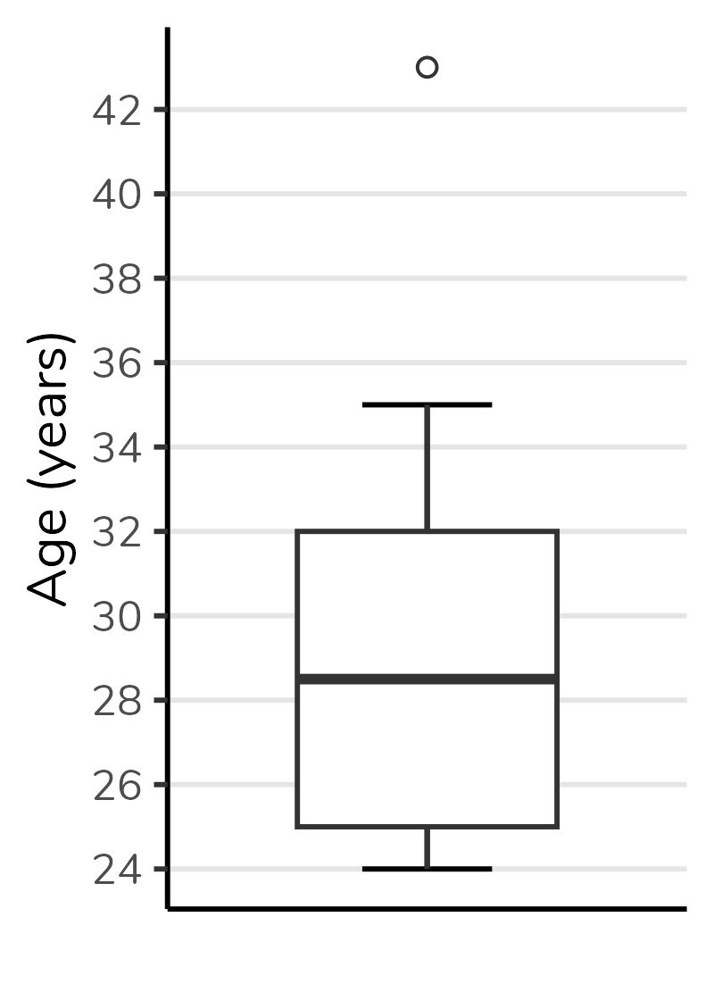
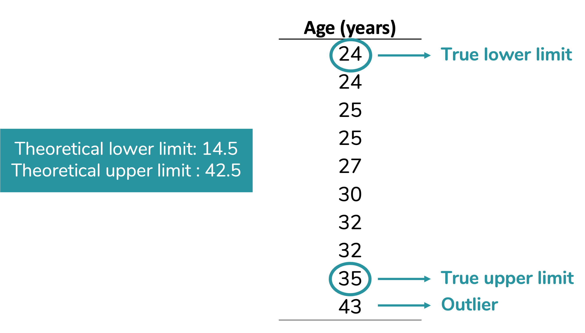
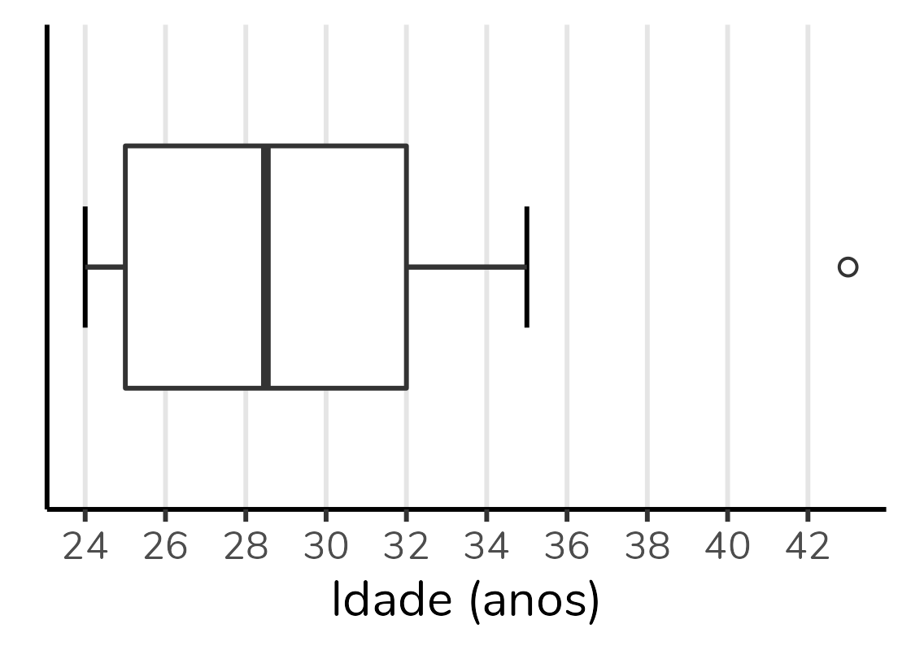
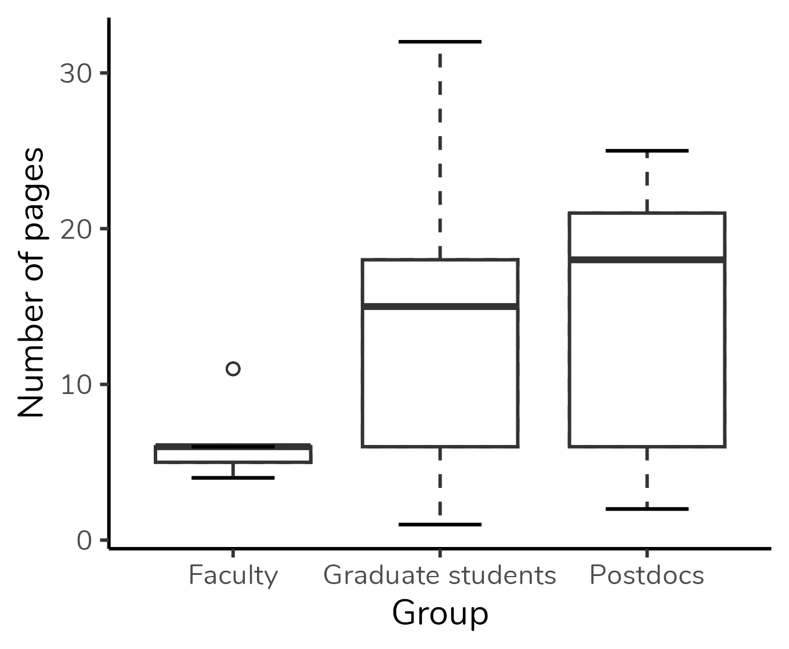
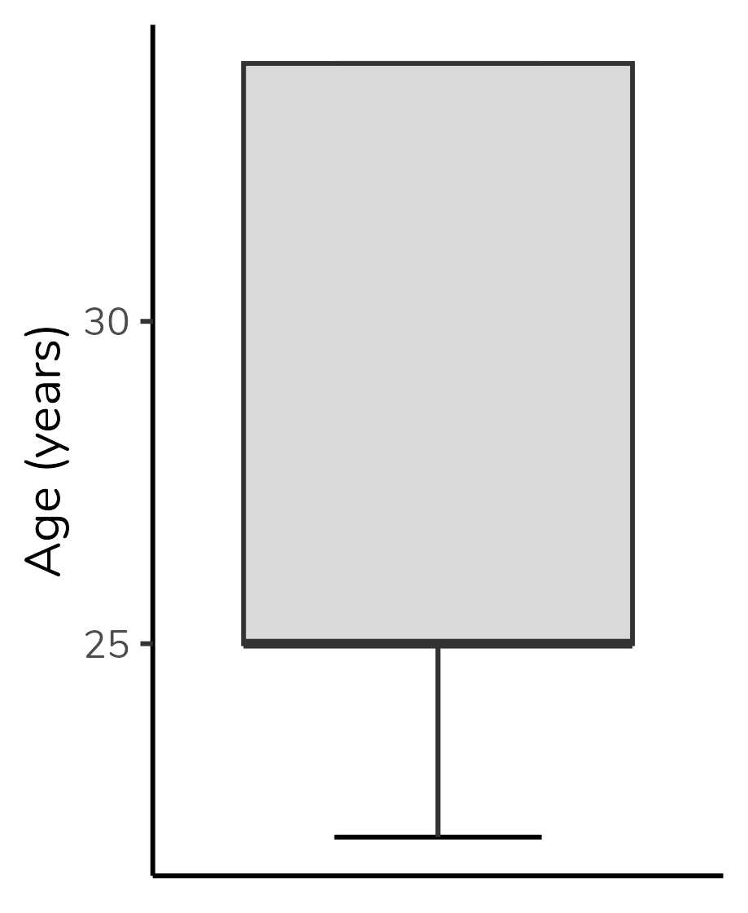
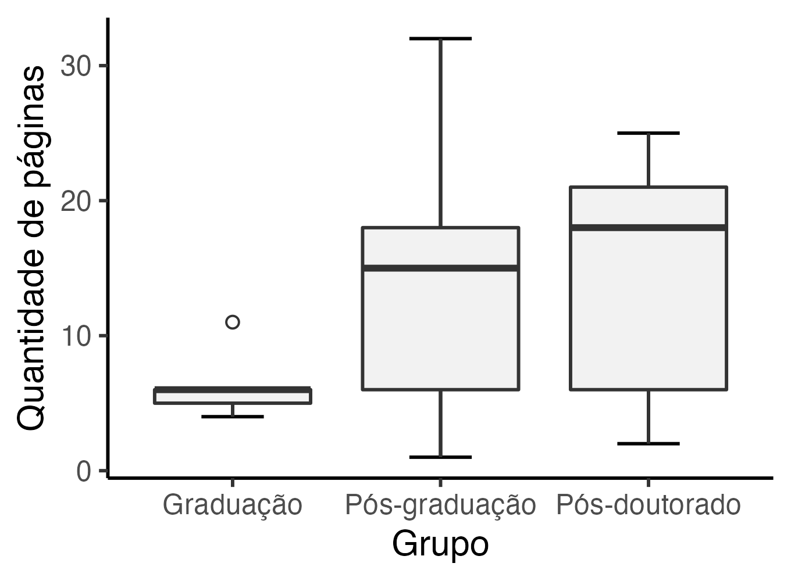

 
```{r, include=FALSE}
knitr::opts_chunk$set(fig.width = 5, fig.height = 5, cache = TRUE)
library(tidyverse)
```
  
If you are in academia or work with data analysis, you have probably encountered a somewhat peculiar-looking plot such as the above (based on the research article of @schenk2014too). This type of plot is named boxplot. In this post, we are going to discuss how to interpret it.

Boxplot depicts five parameters of the data: minimum value (that is not an outlier), first quartile (Q1), median (= second quartile), third quartile (Q3) and maximum value (that is not an outlier). It also depicts any outlier value. Therefore, to properly interpret a boxplot, we need to understand each of these parameters.
  
```{r, include=FALSE}
Pages <- c(4, 5, 6, 6, 11, 1, 4, 6, 13, 15, 15, 18, 19,
             32, 2, 4, 6, 13, 18, 18, 21, 21, 25)
Group <- c(rep("Faculty", 5), rep("Graduate students", 9), rep("Postdocs", 9))

dados <- as.data.frame(Pages)
dados$Group <- factor(Group, levels = c("Faculty", "Graduate students", "Postdocs"))

g1 <- ggplot(dados, aes(x = Group, y = Pages)) +
  geom_boxplot(linetype = "dashed", outlier.shape = 1) +
  stat_boxplot(aes(ymin = ..lower.., ymax = ..upper..), outlier.shape = 1) +
  stat_boxplot(geom = "errorbar", aes(ymin = ..ymax..), width = 0.4) +
  stat_boxplot(geom = "errorbar", aes(ymax = ..ymin..), width = 0.4) +
  labs(y = "Number of pages") +
  theme_classic() +
  theme(text = element_text(family = "Nunito"))

ggsave(plot = g1, "g1.png", width = 3.4, height = 2.8, dpi = 400)
```
  
```{r, echo=FALSE, fig.align='center', out.width = '450px'}

```
  
  
### Quartiles and median  
  
As you can see in the figure above, quartiles are the parameters that delimit the box in a boxplot. Ok, but what are quartiles? I find it easier to understand quartiles after understanding the median. So, we will start with the median.  
  
#### Median
  
The median is the middle value of a dataset after sorting the data in ascending (or descending) order. It means thar the median divided the dataset in two equal parts: 50% od the values will be equal to or lower than the median, and the other 50% of the values will be equal to or higher than the median. Let’s see it in an example.  
  
Note that in the dataset below (already sorted in ascending order), the value 30 occupies the central position: 50% of the values are lower than 30, and the other 50% are higher.  
  
```{r, echo=FALSE, fig.align='center', out.width= '220px'}
knitr::include_graphics("g3.png")
```
  

Ok, but what if we have a dataset with an even number of values? Then the median will be the mean between the two central values, as we can see in the example below.  
  
```{r, echo=FALSE, fig.align='center', out.width= '330px'}

```
  
#### Quartiles
  
The reasoning behind quartiles is similar to the median one. But, instead of dividing the dataset in two equal parts, the quartiles divide it in four equal parts (hence name quartiles), each containing 25% (one quarter) of the data. See that in the example below. Note that quartile 2 is equivalent to the median.     
  
```{r, echo=FALSE, fig.align='center', out.width= '470px'}

```
  
Despite the logic being always the same, the calculation of quartiles may vary. For example, some calculations include the median, others don’t. Therefore, the quartile values calculated by different statistical softwares may differ. To better understand these differences, I suggest the article by @hyndman1996sample.
  
The second quartile (i.e. the median) will be the line divides the boxplot box in two parts. The first quartile (Q1) will be the bottom of the box and the third quartile (Q3) will be the top. The figure below shows a boxplot constructed with the values from the dataset above. Note that the bottom of the box corresponds to 25, the top to 32 and the line in the center to 28.5.  
  
We can also notice that the height of the box corresponds to the difference between the third and first quartiles (Q1 - Q3). This difference is called **interquartile range**, and commonly abbreviated as IQR. Note that in the boxplot below the IQR, that is, the height of the box, is equal to 32 - 25 = 7.  
  
```{r, echo=FALSE, fig.align='center', out.width = '200px'}
df <- c(24, 24, 25, 25, 27, 30, 32, 32, 35, 43)
df <- as.data.frame(df)

g6 <- ggplot(df, aes(x = "", y = df)) +
  geom_errorbar(stat = "boxplot", width = 0.3) +
  geom_boxplot(outlier.shape = 1, width = 0.6) +
  scale_y_continuous(breaks = seq(24, 44, by = 2)) +
  labs(y = "Age (years)", x = NULL) +
  theme_classic() +
  theme(text = element_text(family = "Nunito"),
        axis.ticks.x = element_blank(),
        panel.grid.major.y = element_line(color = "grey90"))

ggsave(plot = g6, "g6.png", width = 2, height = 2.8, dpi = 400)


```
  
### Lower and upper limits
  
In addition to the quartiles, a boxplot also depicts **the upper and lower limits**. These limits correspond to the **minimum and maximum values that are not outliers**, respectively. A outlier is a data point that differs significantly from other values in the same dataset.  
  
How do we define whether a value is an outlier? To define that in a boxplot, we first calculate the **theoretical** upper and lower limits. These theoretical limits depend on the interquartile range (IQR), as follows:  
  
<center>
> Theoretical lower limit = $Q1 - 1.5 \times IQR$  
Theoretical upper limit = $Q3 + 1.5 \times IQR$  

</center>
  
In fact, this 1.5 can vary. However, 1.5 is the **default value** for calculating these limits. When we use the value of 1.5, we are creating Tukey's boxplot (the boxplot that comes out by default in statistical softwares). Approximately 0.7% of the values will be considered outliers if we use this criterion - if you want to delve deeper, there is a discussion in [this link](https://www.kaggle.com/general/129242).  
  
To make more sense of this, let's calculate the limits for our data:  
  
<center>
Theoretical lower limit = $Q1 - 1.5 \times AIQ$  
Theoretical lower limit = $25 - 1.5 \times 7$  
Theoretical lower limit = $25 - 10.5$  
Theoretical lower limit = $14.5$  
  
<br><br>

Theoretical upper limit = $Q3 + 1.5 \times AIQ$  
Theoretical upper limit = $32 + 1.5 \times 7$  
Theoretical upper limit = $32 + 10.5$  
Theoretical upper limit = $42.5$  
  
</center>
  
Our next step will be compare the theoretical limits calculated with the minimum and maximum values of our data.  
You can notice in our dataset there are no values below our theoretical lower limit. Therefore, the true lower limit of our dataset - which will be plotted on the graph - will be the lowest value in the data: 24.  
On the other hand, there is one value above our theoreticall upper limit: 43. This value will be considered an outlier. The true upper limit, which will be plotted on the graph, will be the highest value of our datset excluding the outlier: 35. Given than 43 is an outlier for this dataset, it will be plotted a circle (usually open).  
  
  
```{r, echo=FALSE, fig.align='center', out.width= '450px'}

```
  
Observe how the boxplot presents this information:  
  
```{r, echo=FALSE, fig.align='center', out.width = '200px'}

```
  
### Horizontal boxplots  
  
We can also plot a boxplot with horizontal orientation, with group variable in y-axis and numeric variable in the x-axis, as we can see in the figure below. We will interpret this plot exacly as we have interpreted the previous one.    
  
```{r, echo=FALSE, fig.align='center', out.width = '330px'}
g8 <- ggplot(df, aes(x = "", y = df)) +
  geom_errorbar(stat = "boxplot", width = 0.3) +
  geom_boxplot(outlier.shape = 1, width = 0.6) +
  scale_y_continuous(breaks = seq(24, 44, by = 2)) +
  labs(y = "Age (years)", x = NULL) +
  coord_flip() +
  theme_classic() +
  theme(text = element_text(family = "Nunito"),
        axis.ticks.y = element_blank(),
        panel.grid.major.x = element_line(color = "grey90"))

ggsave(plot = g8, "g8.png", height = 2, width = 2.8, dpi = 400)


```
  
### Ok, but what about the weird boxplots?  
  
When I posted some content about boxplot on [my Instagram account](https://instagram.com/estatisticaaplicada) (in PT-BR), the question I received the most was: "ok, but how to interpret the boxplots with missing pieces?".  
People were talking about boxplots such as the one for Faculty in the plot below:  
  
```{r, echo=FALSE, fig.align='center', out.width = '350px', fig.cap=paste0('Boxplot based on the research article of @schenk2014too.')}

```
  
But there's not much mystery to it. All the elements we've discussed - the lower limit, Q1, Q2, Q3, and upper limit - will always be present in a boxplot. If you're not seeing one of them, it's because its value coincides with another one, and they are overlaping in the plot.

In the Faculty group, the median is overlapped with Q3 and with the upper limit - in other words, for this group, the median, Q3, and the upper limit are identical. That is why we don't see the "T" projecting itself beyond the top of the box, and it is also why the top of the box is represented by a thicker line than the bottom of the box: this indicates that the median is there, in the top.  
  
Let's check some other examples.  
  
In the plot below, median overlaps with Q1. We know that because the bottom of the box is represented by a thicker line:  
  
```{r, echo=FALSE, fig.align='center', out.width = '180px'}
dados <- c(24, 23, 25, 25, 25, 25, 32, 32, 35, 37)

dados <- as.data.frame(dados)

g9 <- ggplot(dados, aes(y = dados)) +
  geom_errorbar(stat = "boxplot", width = 0.4) +
  geom_boxplot(outlier.shape = 1, outlier.size = 2.5,
               fill = "grey85") +
  labs(y = "Age (years)") +
  coord_cartesian(xlim = c(-0.5,0.5)) +
  theme_classic() +
  theme(axis.text.x = element_blank(),
        axis.ticks.x = element_blank(),
        text = element_text(family = "Nunito"))

ggsave(plot = g9, "g9.png", height = 2.8, width = 2.3, dpi = 400)

knitr::include_graphics("g9.png")
```
  
In this next plot, the median overlaps with Q1 (the bottom of the box is represented by a thicker line), and the upper limit is overlapped with Q3 (there is no "T" extending beyond the upper limit): 
  
```{r, echo=FALSE, fig.align='center', out.width = '180px'}
dados <- c(22, 22, 25, 25, 25, 25, 34, 34, 34, 34)

dados <- as.data.frame(dados)

g10 <- ggplot(dados, aes(y = dados)) +
  geom_errorbar(stat = "boxplot", width = 0.4) +
  geom_boxplot(outlier.shape = 1, outlier.size = 2.5,
               fill = "grey85") +
  labs(y = "Age (years)") +
  coord_cartesian(xlim = c(-0.5,0.5)) +
  theme_classic() +
  theme(axis.text.x = element_blank(),
        axis.ticks.x = element_blank(),
        text = element_text(family = "Nunito"))

ggsave(plot = g10, "g10.png", height = 2.8, width = 2.3, dpi = 400)


```
  
  
### When to use a boxplot?  
  
In what situations one should to use a boxplot?  
  
A boxplot is used when we want to represent the distribution of a **numerical or ordinal variable**. In our example, we represented the distribution of the variable "age" (a numerical variable) in our sample.  
  
In addition to the numeric/ordinal variable, we can **include a grouping variable**, as shown in the boxplot at the beginning of the post. This boxplot displays the distribution of the number of pages of articles selected by students divided into three groups: faculty, graduate students, and postdocs. We can easily see that the median number of pages in the "Faculty" group is lower than the medians of the other groups. Also, the group with the highest absolute variation (i.e., the greatest difference between the highest and lowest values) is the "Graduate students" group. On the other hand, the "Postdocs" group exhibits the highest interquartile range (i.e., the tallest box). Boxplot can also be used to evaluate the symmetry of the distribution, but this is a discussion for another post.  
  
```{r, echo=FALSE, fig.align='center', out.width = '350px', fig.cap=paste0('Boxplot based on the research article of @schenk2014too.')}

```
  
You should also notice that boxplot is not based on the mean or on measures of dispersion related to the mean (e.g. variance and standard deviation). Therefore, it is an excellent plot for distributions that **are not well represented by the mean**, making it great for non-normal distributions.  
  
Of course, it is not a graph for all audiences. It took me lots of paragraphs to explain it. The boxplot is an excellent plot for academic publications or for data exploring by data scientists/ analysts. But, it is not well-suited for scientific communication or news articles.  
  
  
### How to construct a boxplot?  
  
It is possible to create a boxplot in Excel. You can find the step-by-step on [YouTube videos](https://youtu.be/39lsUsJsc2c?si=VQtLH8XjcO6mU8-H).  
  
If you are a fan of R programming, my suggestion is to create the boxplot using the `ggplot2` package. The details of the grammar of graphs, used by `ggplot2`, are beyond the scope of this post. But, with the code below you will be able to create a simple boxplot. Using a data frame called `data` containing the groups in one column (Group) and the number of pages in another (Pages):  
  
```{r, include=FALSE}
Pages <- c(4, 5, 6, 6, 11, 1, 4, 6, 13, 15, 15, 18, 19,
             32, 2, 4, 6, 13, 18, 18, 21, 21, 25)
Group <- c(rep("Faculty", 5), rep("Graduate students", 9), rep("Postdocs", 9))

data <- as.data.frame(list(Pages = Pages, Group = Group))
data$Group <- factor(Group, levels = c("Faculty", "Graduate students", "Postdocs"))


g11 <- ggplot(data, aes(x = Group, y = Pages)) +
  geom_errorbar(stat = "boxplot", width = 0.3) +
  geom_boxplot(outlier.shape = 1, fill = "grey95") +
  labs(y = "Number of pages") +
  theme_classic()

ggsave(plot = g11, "g11.png", height = 2.5, width = 3.4, dpi = 400)
```
  

```{r, eval=FALSE}
ggplot(data, aes(x = Group, y = Pages)) +
  geom_errorbar(stat = "boxplot", width = 0.3) +
  geom_boxplot(outlier.shape = 1, fill = "grey95") +
  labs(y = "Number of pages") +
  theme_classic()
```
```{r, echo=FALSE, fig.align='center', out.width='400px'}

```


  
***
  
### References:  
  
