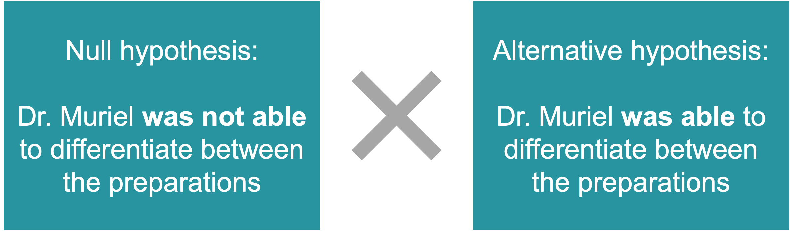
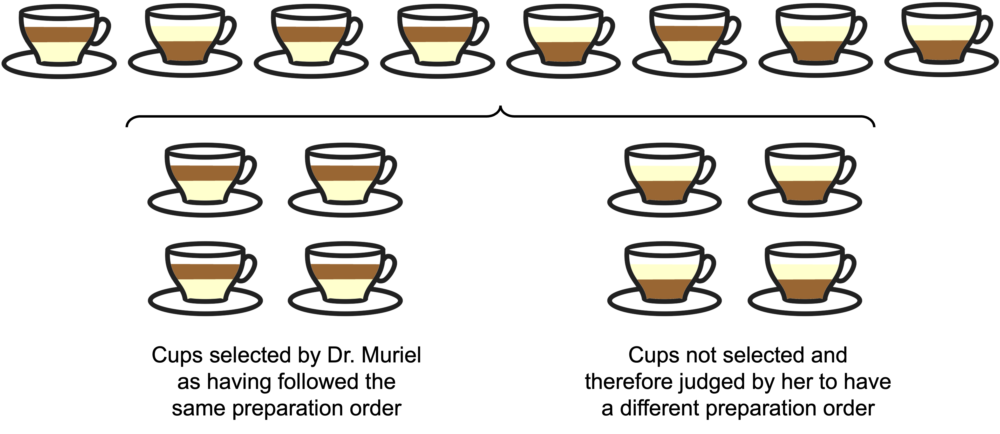
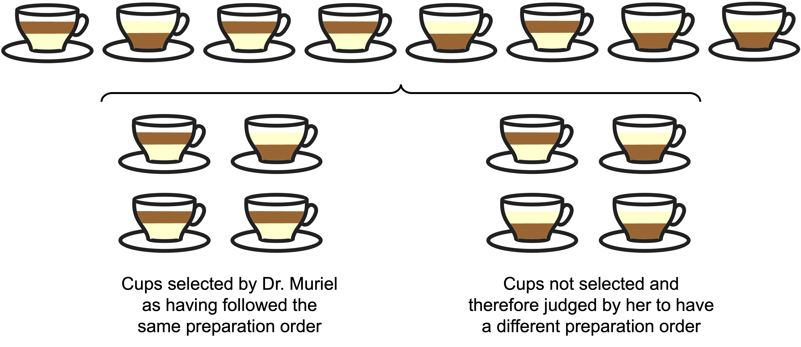

```{r, include=FALSE}
knitr::opts_knit$set(upload.fun = knitr::imgur_upload, base.url = NULL)
knitr::opts_chunk$set(fig.width = 5, fig.height = 5, cache = TRUE)
```
  
## PhD tastes tea

### How to properly interpret the famous and controversial p-value?
  
In my opinion, the concepts of p-value and significance level are among the most confusing and challenging to explain when it comes to statistics. I use statistical tools to analyze my experimental data since 2010. But it wasn't until seven years later, when attending a conference of Brazilian Society of Neuroscience and Behavior, that I truly grasped these two concepts.  
  
The purpose of this blog post is to elucidate these concepts through the history of the creation of the hypothesis test, named "Lady tasting tea".  
  
### The problem
  
Legend - and Ronald Fisher's biography - say that, in one afternoon in the late 1920s, three research workers at the Rothamsted Experimental Station took a break to have a nice cup of tea. The researchers were two men and a woman.   
  
```{r, echo=FALSE, fig.align='center', out.width = '450px'}

```
<center><font size = '3'>Rothamsted Experimental Station in UK</font></center>
<br><br>  
   
One of the man 
  
One of the men poured milk to the cup, added tea, mixed it, and offered the cup to his female co-worker. She politely declined, saying that she preferred when tea was added before milk. He argued that the order didn't make a difference. She insisted, claiming that she could taste the difference and preferred it when the tea was added first.  
  
```{r, echo=FALSE, fig.align='center', out.width = '150px'}
knitr::include_graphics("img2.png")
```
  
If the individuals in this story were different, it likely would have ended there. However, the man in question was Ronald Fisher, a statistician and geneticist who would later be knighted. The female researcher was Blanche Muriel Bristol, an algologist who had already obtained a MSc and a PhD. Unfortunately, much information about Dr. Muriel has been lost over time. However, it is known that a species of algae was named C. *muriella* in her honor, indicating that she made significant contributions to her field.  
  
```{r, echo=FALSE, fig.align='center', out.width = '500px'}

```
  
Ronald Fisher, skeptical that Dr. Muriel could truly distinguish between a cup with tea added before milk and one with tea added after, proposed an experiment to put her claim to the test.  

### The hypothesis
  
We can consider that the experiment allowed the comparison of two hypotheses:
  
* Hypothesis 1: Dr. Muriel, in reality, **was not able to differentiate** between the preparations;
* Hypothesis 2: Dr. Muriel, in reality, **was able to differentiate** between the preparations.
  
Using the terminology commonly employed today and for the sake of clarity, let's refer to the first hypothesis as the "Null Hypothesis (H<sub>0</sub>)" and the second hypothesis, which opposes H<sub>0</sub>, as the "Alternative Hypothesis (H<sub>1</sub>)":  
  
```{r, echo=FALSE, fig.align='center', out.width = '450px'}

```
  
### Alright, but... How to test it?  
  
Fisher could present Dr. Muriel with just one cup and ask her to identify whether the tea had been added before or after the milk. However, in this scenario, even if she couldn't truly differentiate between the preparations, the probability of her guessing correctly would be 50%. The same probability would apply if Dr. Muriel were presented with two cups, knowing that one of each type of preparation was present.  
  
```{r, echo=FALSE, fig.align='center', out.width = '150px'}
knitr::include_graphics("img5.png")
```
  
Fisher ended up proposing an experiment in which 8 cups would be presented to Dr. Muriel: 4 with tea added before milk and 4 with tea added after milk. The order of presentation of these cups would be truly random, determined by a coin flip, making it impossible to predict. In the end, Dr. Muriel – who was aware of how the experiment was designed – would have to identify which four cups belonged to the same type of preparation. Note that if she correctly identified these 4 cups, it would mean she had accurately determined the preparation method for all 8 cups.  
  
```{r, echo=FALSE, fig.align='center', out.width = '600px'}

```
  
With this experimental design, the probability of Dr. Muriel correctly selecting the four cups - without being able to differentate them - would be 1 in 70, which corresponds to
$$\frac{1}{70} \times 100 = 1.43\%$$
  
> Understanding how this calculation was done is entirely unnecessary for grasping the concepts of p-value and significance level, okay? But if you're curious, follow my reasoning below. Feel free to skip this section if you prefer to continue reading.  
Where does the 70 in the denominator of the fraction come from? It corresponds to the possibilities of selecting a set of 4 cups out of the 8. To calculate the number of possibilities, we should use the combination formula (yes, the one you learned in high school):  
$$C_{(8, 4)} = \binom{8}{4} = \frac{8!}{4! \times 4!} = \frac{8 \times 7 \times 6 \times 5}{4 \times 3 \times 2 \times 1} = 70$$
Among all these combinations, there is only one that corresponds to getting all the cups right. Hence, the probability of a person correctly selecting the 4 cups with the same preparation is 1 in 70.  
  
Now, here comes the big question: if Dr. Muriel got all the cups right, would you believe that she has the ability to differentiate between the preparations? Consider that the probability of this happening without her having this ability is only 1.43%. I would believe her, and I imagine you would too.
  
But even if she can differentiate between the preparations, it's possible that she could make a mistake with one of the 4 selected cups, right? One might not have been stirred properly, or it could have a different tea to milk ratio...
  
```{r, echo=FALSE, fig.align='center', out.width = '600px'}

```
  
And in this scenario, would you believe her? Let's calculate the probabilities again. The probability of her getting at least 3 cups right (meaning, getting 3 or 4 cups right) is 17 out of 70, which corresponds to:  
$$\frac{17}{70} = 24,29%$$
  
> Again, if you're interested in how this calculation was done, follow the reasoning below. If this doesn't interest you, feel free to skip this section.
We already know that there are 70 possible combinations of 4 cups out of 8. Among these, only one corresponds to getting all cups right. Now let's calculate how many of the 70 possibilities correspond to getting 3 cups right out of the 4 selected. To do this, we need to compute a combination of 3 out of 4 (selecting 3 cups out of the 4 correct ones) and a combination of 1 out of 4 (selecting 1 cup out of the 4 incorrect ones). Since we want to select 3 correct cups **and** 1 incorrect cup, we need to multiply these results:
$$C_{(4, 3)} \times C_{(4, 1)}$$
$$\binom{4}{3} \times \binom{4}{1}$$
$$\frac{4!}{3! \times 1!} \times \frac{4!}{1! \times 3!}$$
$$4 \times 4 = 16$$
Therefore, the probability of getting at least 3 cups right is 17 (16 + 1) out of 70.
  
The probability of Dr. Muriel getting at least 3 cups right out of the selected ones (meaning at least 6 cups in total), without being able to differentiate between the preparations, is 24.29%. Knowing that, would you believe in her ability to differentiate it if she got six cups right? I suppose your answer is: "no!". Mine is too.  
  
In this story, we used the concepts of p-value and significance level without explicitly naming them. Let's define them now, relating them to the story.  
  
### P-value
  
The p-value is "the probability of obtaining results at least as extreme as the result actually observed, under the assumption that the null hypothesis is correct"[^1].
  
[^1]: p-value: <https://en.wikipedia.org/wiki/P-value>.
  
This definition might sound confusing, but it makes more sense when we interpret it in the context of the story. In the tea case, our null hypothesis was that Dr. Muriel, in reality, was **not able** to differentiate between the tea preparations. So, we calculated the probability of her getting all 8 cups right, considering the null hypothesis to be true. The calculated probability (1.43%) corresponds to our p-value. Similarly, we calculated the probability of another result, her getting *at least* 6 cups right, again considering that the null hypothesis was true. We then obtained another p-value: 24.29%.  
  
### How about the significance level?
  
The significance level is the *cut-off point* we establish for rejecting the null hypothesis.  
  
I asked you if you would believe in Dr. Muriel's ability to differentiate the preparations if she got all 8 cups right. Knowing that the probability of her getting it right without being able to differentiate between the preparations was 1.43%, you likely answered yes. However, when I asked if you would believe her if she got 6 cups right – knowing that the probability of this result was 24.29% – you chose not to believe her.  
  
Notice that to give these answers you set a cut-off point between 1.43% and 24.29%, considering that 1.43% was a low enough probability to convince you to reject the null hypothesis, but 24.29% was not. This cut-off point is your significance level.  
  
In most fields, the most accepted a significance level ($\alpha$) is 5%. You can also be more conservative and set a significance level of 1%, for example. But in this was the case, you would need to design an experiment with more cups. With 8 cups, even if Dr. Muriel got all of them right, we wouldn't have enough evidence to reject the null hypothesis with a $\alpha$ of 1%.  
  
### Okay, but... Did she get it right?
  
Ronald Fisher published this experimental design in his 1935 book "The design of experiments", under the name that made it famous: "Lady tasting tea." In the book, Fisher describes the experiment as hypothetical.  
  
However, there is evidence that this story actualy happened, and Dr. Muriel got all the cups right. There does seem to be a difference in the taste of tea, as tea is added hot to the preparation, while milk is added at room temperature. According to a statement from 2008 by the Royal Society of Chemists, there is more denaturation of milk proteins when it is added after tea, which changes the taste. Reports – unfortunately difficult to check – suggest that Dr. Muriel herself had explained to Fisher that there would be differences in protein denaturation.  
  
This story is also recounted in the famous book "The Lady Tasting Tea" by David Salsburg. However, David refers to the woman as "the wife of a university professor". An unfortunate flaw for a book whose title is based on this episode. Dr. Muriel was a woman with a remarkable scientific career.      
  
<br>

<hr>

### References:

* Senn, S. (2012). Tea for three: of infusions and inferences and milk in first. Significance, 9(6), 30-33. [Link](https://rss.onlinelibrary.wiley.com/doi/full/10.1111/j.1740-9713.2012.00620.x)
* Salsburg, D. (2001). The lady tasting tea: How statistics revolutionized science in the twentieth century. Macmillan.    
  
<br><b><br>  
  

