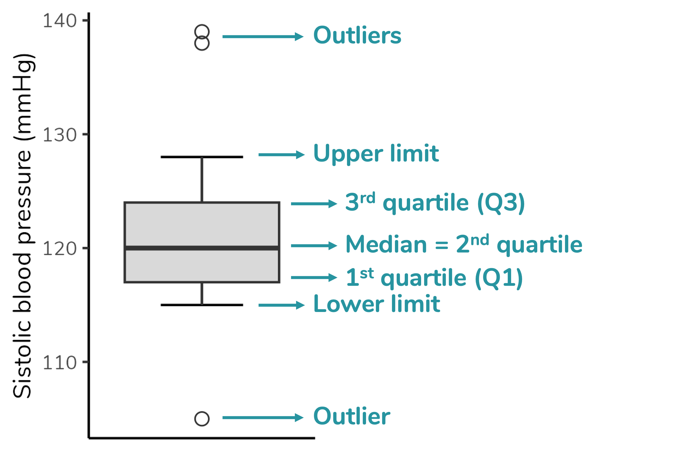
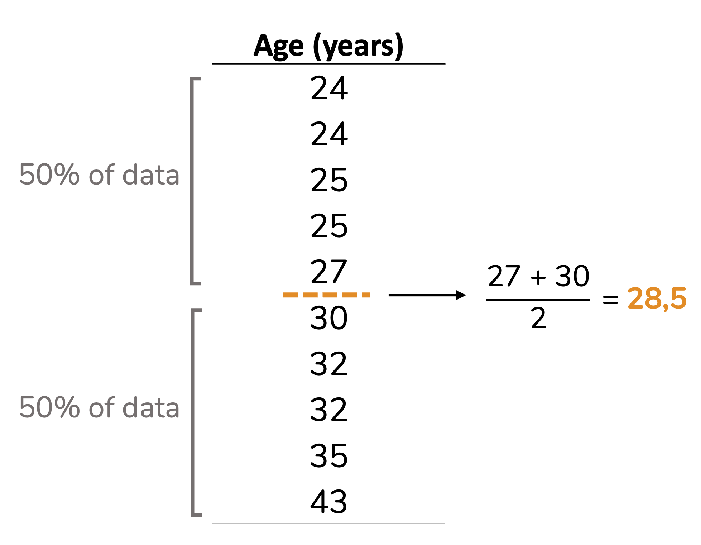
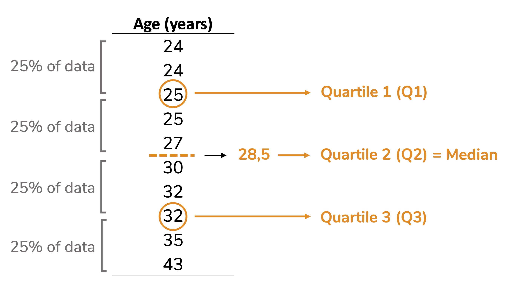
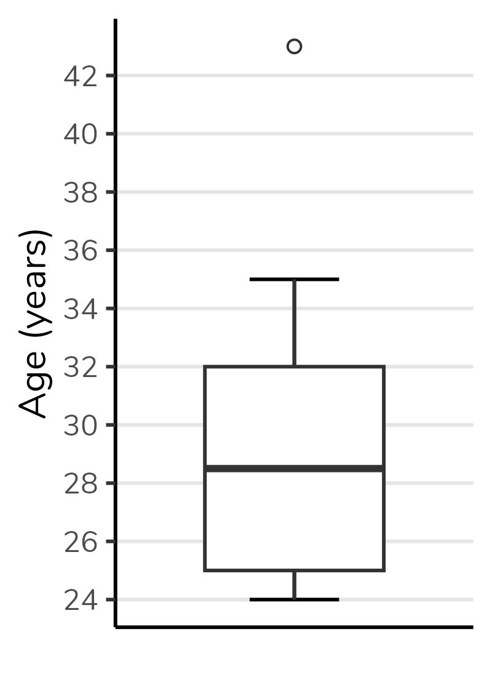
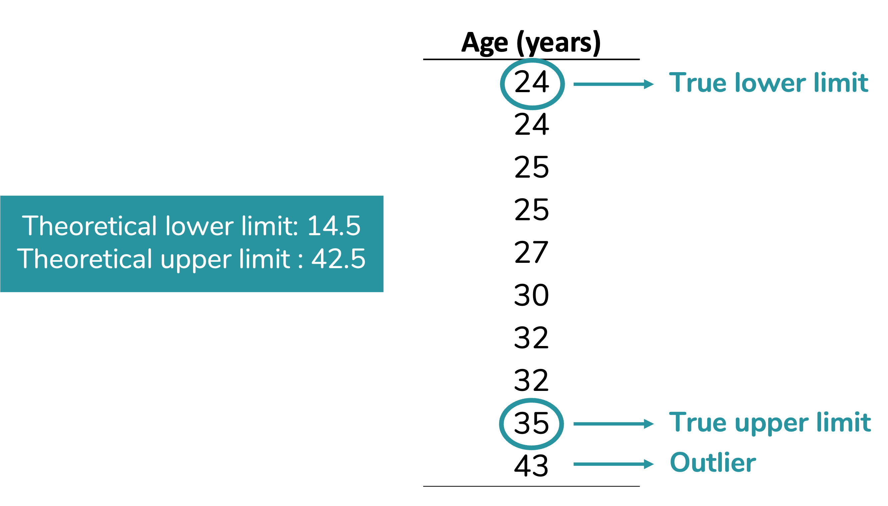
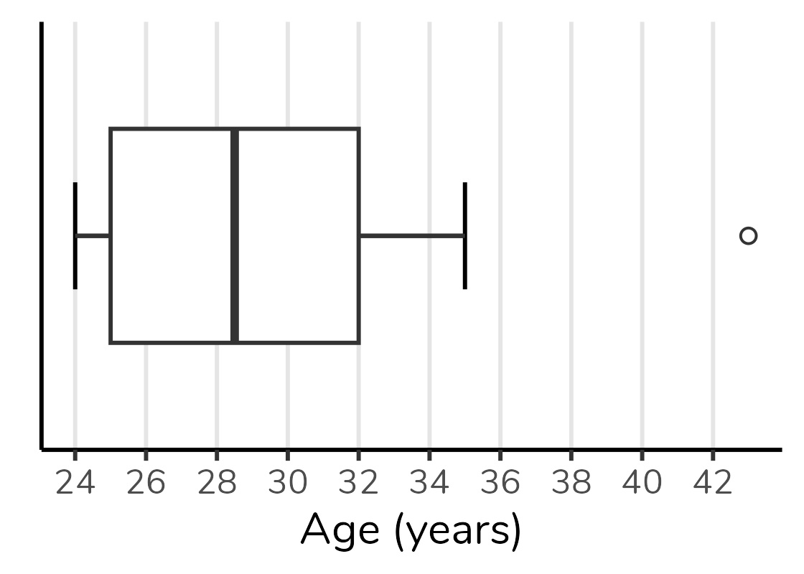
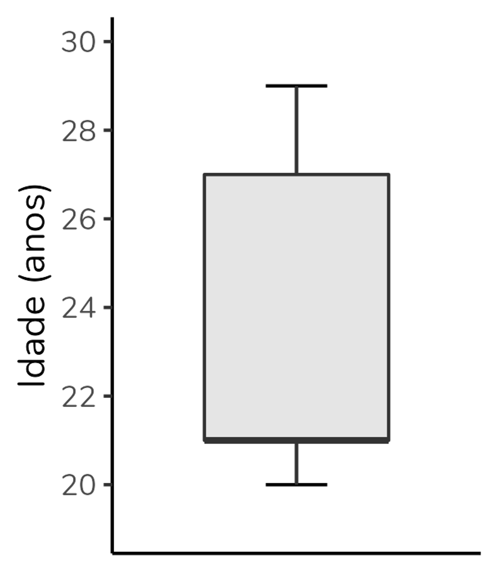
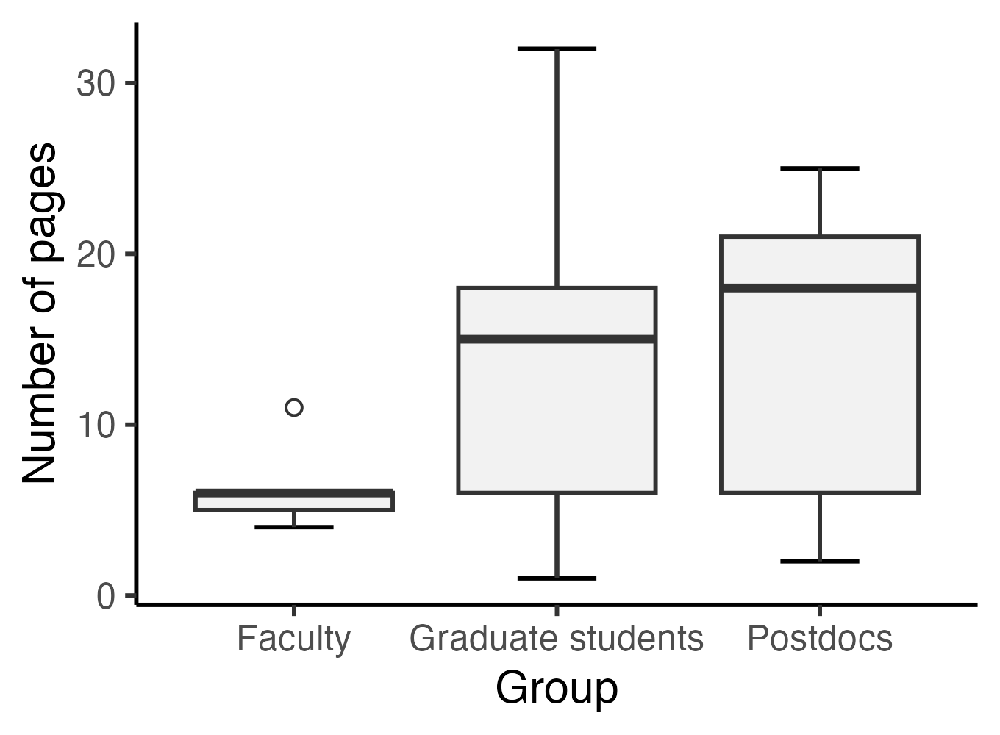

 
```{r, include=FALSE}
knitr::opts_chunk$set(fig.width = 5, fig.height = 5, cache = TRUE)
library(tidyverse)
```
  
If you are in academia or work with data analysis, you have probably encountered a somewhat peculiar-looking plot such as the above. This type of plot is named boxplot. In this post, we are going to discuss how to interpret it.

Boxplot depicts five parameters of the data: minimum value (that is not an outlier), first quartile (Q1), median (= second quartile), third quartile (Q3) and maximum value (that is not an outlier). It also depicts any outlier value. Therefore, to properly interpret a boxplot, we need to understand each of these parameters.
  
```{r, include=FALSE}
Pages <- c(4, 5, 6, 6, 11, 1, 4, 6, 13, 15, 15, 18, 19,
             32, 2, 4, 6, 13, 18, 18, 21, 21, 25)
Group <- c(rep("Faculty", 5), rep("Graduate students", 9), rep("Postdocs", 9))

dados <- as.data.frame(Pages)
dados$Group <- factor(Group, levels = c("Faculty", "Graduate students", "Postdocs"))

g1 <- ggplot(dados, aes(x = Group, y = Pages)) +
  geom_boxplot(linetype = "dashed", outlier.shape = 1) +
  stat_boxplot(aes(ymin = ..lower.., ymax = ..upper..), outlier.shape = 1) +
  stat_boxplot(geom = "errorbar", aes(ymin = ..ymax..), width = 0.4) +
  stat_boxplot(geom = "errorbar", aes(ymax = ..ymin..), width = 0.4) +
  labs(y = "Number of pages") +
  theme_classic() +
  theme(text = element_text(family = "Nunito"))

ggsave(plot = g1, "g1.png", width = 3.4, height = 2.8, dpi = 400)
```
  
```{r, echo=FALSE, fig.align='center', out.width = '350px'}

```
  
  
### Quartiles and median  
  
As you can see in the figure above, quartiles are the parameters that delimit the box in a boxplot. Ok, but what are quartiles? I find it easier to understand quartiles after understanding the median. So, we will start with the median.  
  
#### Median
  
The median is the middle value of a dataset after sorting the data in ascending (or descending) order. It means thar the median divided the dataset in two equal parts: 50% od the values will be equal to or lower than the median, and the other 50% of the values will be equal to or higher than the median. Let’s see it in an example.  
  
Note that in the dataset below (already sorted in ascending order), the value 30 occupies the central position: 50% of the values are lower than 30, and the other 50% are higher.  
  
```{r, echo=FALSE, fig.align='center', out.width= '220px'}
knitr::include_graphics("g3.png")
```
  

Ok, but what if we have a dataset with an even number of values? Then the median will be the mean between the two central values, as we can see in the example below.  
  
```{r, echo=FALSE, fig.align='center', out.width= '330px'}

```
  
#### Quartiles
  
The reasoning behind quartiles is similar to the median one. But, instead of dividing the dataset in two equal parts, the quartiles divide it in four equal parts (hence name quartiles), each containing 25% (one quarter) of the data. See that in the example below. Note that quartile 2 is equivalent to the median.     
  
```{r, echo=FALSE, fig.align='center', out.width= '470px'}

```
  
Despite the logic being always the same, the calculation of quartiles may vary. For example, some calculations include the median, others don’t. Therefore, the quartile values calculated by different statistical softwares may differ. To better understand these differences, I suggest the article by @hyndman1996sample.
  
The second quartile (i.e. the median) will be the line divides the boxplot box in two parts. The first quartile (Q1) will be the bottom of the box and the third quartile (Q3) will be the top. The figure below shows a boxplot constructed with the values from the dataset above. Note that the bottom of the box corresponds to 25, the top to 32 and the line in the center to 28.5.  
  
We can also notice that the height of the box corresponds to the difference between the third and first quartiles (Q1 - Q3). This difference is called **interquartile range**, and commonly abbreviated as IQR. Note that in the boxplot below the IQR, that is, the height of the box, is equal to 32 - 25 = 7.  
  
```{r, echo=FALSE, fig.align='center', out.width = '200px'}
df <- c(24, 24, 25, 25, 27, 30, 32, 32, 35, 43)
df <- as.data.frame(df)

g6 <- ggplot(df, aes(x = "", y = df)) +
  geom_errorbar(stat = "boxplot", width = 0.3) +
  geom_boxplot(outlier.shape = 1, width = 0.6) +
  scale_y_continuous(breaks = seq(24, 44, by = 2)) +
  labs(y = "Age (years)", x = NULL) +
  theme_classic() +
  theme(text = element_text(family = "Nunito"),
        axis.ticks.x = element_blank(),
        panel.grid.major.y = element_line(color = "grey90"))

ggsave(plot = g6, "g6.png", width = 2, height = 2.8, dpi = 400)


```
  
### Lower and upper limits
  
In addition to the quartiles, a boxplot also depicts **the upper and lower limits**. These limits correspond to the **minimum and maximum values that are not outliers**, respectively. A outlier is a data point that differs significantly from other values in the same dataset.  
  
How do we define whether a value is an outlier? To define that in a boxplot, we first calculate the **theoretical** upper and lower limits. These theoretical limits depend on the interquartile range (IQR), as follows:  
  
<center>
> Theoretical lower limit = $Q1 - 1.5 \times IQR$  
Theoretical upper limit = $Q3 + 1.5 \times IQR$  

</center>
  
In fact, this 1.5 can vary. However, 1.5 is the **default value** for calculating these limits. When we use the value of 1.5, we are creating Tukey's boxplot (the boxplot that comes out by default in statistical softwares). Approximately 0.7% of the values will be considered outliers if we use this criterion - if you want to delve deeper, there is a discussion in [this link](https://www.kaggle.com/general/129242).  
  
To make more sense of this, let's calculate the limits for our data:  
  
<center>
Theoretical lower limit = $Q1 - 1.5 \times AIQ$  
Theoretical lower limit = $25 - 1.5 \times 7$  
Theoretical lower limit = $25 - 10.5$  
Theoretical lower limit = $14.5$  
  
<br><br>

Theoretical upper limit = $Q3 + 1.5 \times AIQ$  
Theoretical upper limit = $32 + 1.5 \times 7$  
Theoretical upper limit = $32 + 10.5$  
Theoretical upper limit = $42.5$  
  
</center>
  
Our next step will be compare the theoretical limits calculated with the minimum and maximum values of our data.  
You can notice in our dataset there are no values below our theoretical lower limit. Therefore, the true lower limit of our dataset - which will be plotted on the graph - will be the lowest value in the data: 24.  
On the other hand, there is one value above our theoreticall upper limit: 43. This value will be considered an outlier. The true upper limit, which will be plotted on the graph, will be the highest value of our datset excluding the outlier: 35. Given than 43 is an outlier for this dataset, it will be plotted a circle (usually open).  
  
  
```{r, echo=FALSE, fig.align='center', out.width= '450px'}

```
  
Observe how the boxplot presents this information:  
  
```{r, echo=FALSE, fig.align='center', out.width = '200px'}

```
  
### Horizontal boxplots  
  
É possível (e até comum em algumas áreas) representar boxplots na horizontal, ou seja, com a variável de grupo no eixo y (vertical) e a variável numérica no eixo x (horizontal).  
A interpretação será a mesma. Veja abaixo o mesmo boxplot que construímos, mas na horizontal:  
  
```{r, echo=FALSE, fig.align='center', out.width = '330px'}
g8 <- ggplot(df, aes(x = "", y = df)) +
  geom_errorbar(stat = "boxplot", width = 0.3) +
  geom_boxplot(outlier.shape = 1, width = 0.6) +
  scale_y_continuous(breaks = seq(24, 44, by = 2)) +
  labs(y = "Idade (anos)", x = NULL) +
  coord_flip() +
  theme_classic() +
  theme(text = element_text(family = "Nunito"),
        axis.ticks.y = element_blank(),
        panel.grid.major.x = element_line(color = "grey90"))

ggsave(plot = g8, "g8.png", height = 2, width = 2.8, dpi = 400)


```
  
Eu confesso que sou tradicional e tendo a preferir os boxplots na vertical, mas é uma questão de estilo. Sinta-se livre para usar como preferir.  
  
### E os boxplots esquisitinhos?  
  
Quando eu fiz um conteúdo no [Instagram](https://instagram.com/estatisticaaplicada) explicando a construção e interpretação de boxplots, a pergunta que eu mais recebi foi: "tá, mas e aqueles boxplots com pedaços faltando?".  
As pessoas se referiam a boxplots como o do grupo "Graduação" no gráfico abaixo, mostrado no início do post:  
  
```{r, echo=FALSE, fig.align='center', out.width = '350px', fig.cap=paste0('Gráfico boxplot, inspirado no gráfico do artigo de @schenk2014too.')}
knitr::include_graphics("g1.png")
```
  
Mas, não há muito segredo. Todos os elementos que vimos - limite inferior, Q1, Q2, Q3, limite inferior - sempre estarão no boxplot. Se você não está enxergando um deles, é porque seu valor coincide com outro, e haverá sobreposição no gráfico.  
No caso do grupo "Graduação", a mediana está sobreposta ao Q3 e ao limite superior - ou seja, para esse grupo a mediana, o Q3 e o limite superior são valores idênticos. É por isso que não estamos vendo o T se projetando para além do topo da caixa e é também por isso que o topo da caixa está representado por uma linha mais grossa que a base da caixa (indicando que a mediana está lá).  
  
Vejamos mais alguns exemplos.  
  
No gráfico abaixo, a mediana se sobrepõe ao Q1 (note que a base da caixa está representada por uma linha mais grossa):  
  
```{r, echo=FALSE, fig.align='center', out.width = '180px'}

```
  
Já nesse gráfico, a mediana se sobrepõe ao Q1 (a base da caixa está representada por uma linha mais grossa) e o limite superior está sobreposto ao Q3 (não há o clássico T se projetando paa além do limite superior):  
  
```{r, echo=FALSE, fig.align='center', out.width = '180px'}
knitr::include_graphics("g10.png")
```
  
  
### Quando usar um gráfico boxplot?  
  
Em quais situações faz sentido usar um gráfico boxplot?  
Trata-se de um gráfico usado quando queremos representar a distribuição de uma **variável numérica ou, pelo menos, ordinal**. No caso, representamos a distribuição da variável idade na nossa amostra.  
Além da variável numérica/ ordinal, podemos **incluir uma variável de grupo**, como o boxplot do começo do post. Esse boxplot que mostra a distribuição da quantidade de páginas de artigos selecionados por alunos divididos em três grupos: graduação, pós-graduação e pós-doutorado. Basta uma rápida olhada para percebermos que a mediana de páginas do grupo “Graduação” é inferior às medianas dos demais grupos. Podemos também observar que o grupo com maior variação absoluta (ou seja, maior diferença entre o maior e menor valor) é o grupo "Pós-graduação". Já o grupo "Pós-doutorado" apresenta a maior amplitude interquartil (ou seja, a caixa mais alta). Poderíamos também usar o boxplot para avaliar a simetria da distribuição, mas essa discussão fica para outro post.  
  
  
```{r, echo=FALSE, fig.align='center', out.width = '350px'}
knitr::include_graphics("g1.png")
```
<center>Gráfico boxplot, inspirado no gráfico do artigo de @schenk2014too.</center><br>
  
  
Além disso, perceba que o boxplot não é baseado em média nem em medidas de dispersão derivadas da média (como desvio-padrão e variância). Portanto, é um gráfico excelente para **distribuições que não são bem representadas pela média**, sendo ótimo para distribuições não-normais.  
  
Mas, claro, não é um gráfico para todas as audiências. Veja quantos parágrafos eu gastei para explicá-lo nesse texto. O boxplot é excelente para uso pelo time de dados, para publicações acadêmicas, mas em geral péssimo para contextos como divulgação científica e matérias jornalísticas.  
  
### Como fazer um boxplot?  
  
Nas suas últimas versões, o Excel implementou o boxplot. [Nesse vídeo](https://youtu.be/DWs98A0yCMQ) eu explico como fazê-lo.  
  
Se você for um amante do R (como eu), minha sugestão é montar o boxplot pelo pacote `ggplot2`. Eu tenho um vídeo bem detalhado sobre [boxplot no ggplot2](https://youtu.be/-XQPlOG12vc).  
Se ggplot2 é algo que te angustia (socorro, por que tantas linhas para gerar um único gráfico?), eu tenho uma playlist com vários vídeos ensinando a construir [gráficos no ggplot2 do zero](https://youtube.com/playlist?list=PLOw62cBQ5j9X5eOavzeu9CaHMO6TFsPkY). Efeitos colaterais de aprender a mexer no ggplot2: amor incondicional e não querer fazer sequer um gráfico de barras em outro software, haha!  
  
Mas, vou deixar um código simples, para você usar como base. Partindo de um `data frame` chamado `dados` contendo os grupos em uma coluna e a quantidade de páginas em outra, temos:
  
  
```{r, include=FALSE}
g11 <- ggplot(dados, aes(x = Grupo, y = Páginas)) +
  geom_errorbar(stat = "boxplot", width = 0.3) +
  geom_boxplot(outlier.shape = 1, fill = "grey95") +
  labs(y = "Quantidade de páginas") +
  theme_classic()

ggsave(plot = g11, "g11.png", height = 2.5, width = 3.4, dpi = 400)
```
  

```{r, eval=FALSE}
ggplot(dados, aes(x = Grupo, y = Páginas)) +
  geom_errorbar(stat = "boxplot", width = 0.3) +
  geom_boxplot(outlier.shape = 1, fill = "grey95") +
  labs(y = "Quantidade de páginas") +
  theme_classic()
```
```{r, echo=FALSE, fig.align='center', out.width='400px'}

```


  
***
  
### Referências:  
  
